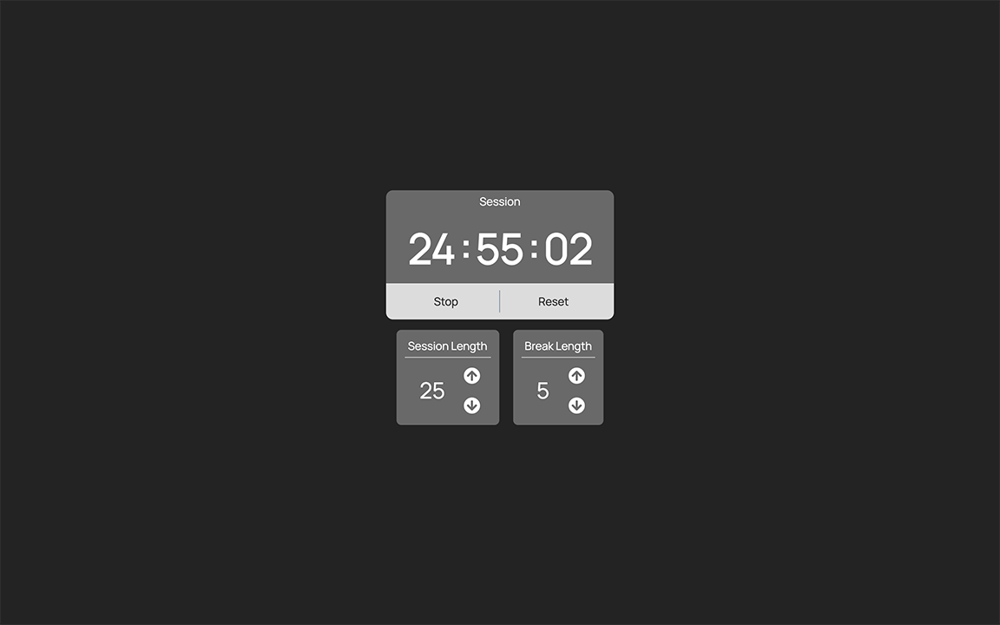
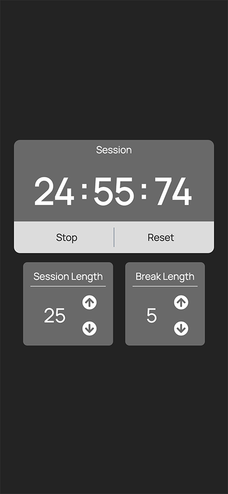

# 25 + 5 Clock

A pomodoro timer with start/stop, reset, stop beeping buttons and settings panel.  
This is one of my project for [Front End Development Libraries Projects](https://www.freecodecamp.org/learn/front-end-development-libraries/) on [freeCodeCamp](https://www.freecodecamp.org/): [Build a 25 + 5 Clock](https://www.freecodecamp.org/learn/front-end-development-libraries/front-end-development-libraries-projects/build-a-25--5-clock).

## Table of Content

- [Live Demo](#live-demo)
- [Final Product](#final-product)
- [Getting Started](#getting-started)
- [Dependencies](#dependencies)
- [Credit](#credit)

## Live demo

This project was bootstrapped with [Create React App](https://github.com/facebook/create-react-app). It is deployed to [Netlify](https://www.netlify.com/):
https://25-5.netlify.app/

## Final Product

|  |
| :----------------------------: |
|   _The web page on desktop_    |

|  |
| :--------------------------: |
|   _The web page on mobile_   |

## Getting Started

1. Clone or download this repository onto your local device.
2. `cd` to the folder where this project is cloned.
3. Install all dependencies with `npm install` command.
4. Run the app in the development mode with `npm start` command.
5. Open the broswer and visit: [http://localhost:3000/](http://localhost:3000/).

## Dependencies

- [React](https://reactjs.org/): library for building the UI.
- [Font Awesome](https://fontawesome.com/): for icons.

## Credit

- [Favicons](https://www.flaticon.com/premium-icon/clock_3511918) made by [Freepik](https://www.freepik.com) from [www.flaticon.com](https://www.flaticon.com/).
